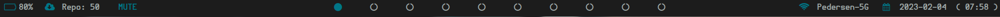

# Polybar Themes
## Polybar configurations I have made and/or used on my system

- These have all been tested on my system
- Some of the modules require one of my scripts to run
- Please read through the configuration of each theme to verify if any of my scripts or any dependencies are needed for theme to work correctly.
- Polybar_2 theme is in separate file from modules
- Polybar_2 also uses [powerline-for-polybar by bacara](https://github.com/bacara/powerline-for-polybar)
- Polybar_4 to have the bar broken up, this theme is running each individual module as its own instance of polybar in my launch script, ie my script calls polybar -c /path/to/polybar mainbar-left &, polybar -c /path/to/polybar -c mainbar-right &, etc. There is probably a better way to do this but I just have not tried at the moment.

## Polybar_1 screenshot

## Polybar_2 screenshot

## Polybar_3 screenshot

## Polybar_4 screenshot

## Polybar_5 screenshot

## Polybar_6 screenshot

